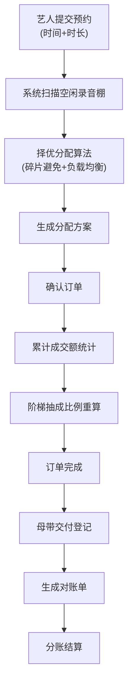

## 1. 产品概述
录音棚档期管理系统是一款面向音乐制作行业的智能调度平台，解决录音棚资源碎片化、分配效率低下、分账计算复杂等行业痛点。通过智能分配算法实现资源最优利用，通过阶梯抽成机制激励业绩增长。
- 面向录音棚运营方、艺人/制作人两类核心用户
- 核心价值：资源利用率提升30%+，分账结算效率提升80%

## 2. 核心功能

### 2.1 用户角色
| 角色 | 注册方式 | 核心权限 |
|------|----------|----------|
| 运营管理员 | 后台创建 | 录音棚建档、排期管理、分配规则配置、抽成阶梯设置、对账审核、母带交付登记 |
| 艺人/制作人 | 自助注册 | 提交预约、查看档期、查看分账明细、母带确认 |

### 2.2 功能模块
1. **录音棚排期模块**：录音棚资源建档、可视化排期日历、负载均衡监控
2. **自动分配模块**：智能择优分配算法、碎片避免机制、实时分配确认
3. **阶梯抽成模块**：成交额阶梯设置、累计销量统计、分账比例动态调整
4. **对账明细模块**：订单流水、分账计算、对账单生成、母带交付登记

### 2.3 页面详情
| 页面名称 | 模块名称 | 功能描述 |
|----------|----------|----------|
| 仪表盘 | 数据概览 | 本月成交额、棚利用率TOP5、待分配预约数、阶梯抽成进度条 |
| 录音棚管理 | 录音棚排期 | 录音棚CRUD、录音棚规格（大/中/小棚）、设备配置、日/周/月排期视图 |
| 预约管理 | 自动分配 | 预约列表、智能分配按钮、分配结果预览、手动调整、分配日志 |
| 抽成配置 | 阶梯抽成 | 阶梯档位设置（成交额区间-抽成比例）、模拟计算、历史版本 |
| 分账明细 | 对账明细 | 订单列表、自动分账计算、月度对账单、导出Excel |
| 母带管理 | 母带交付 | 交付登记、版本管理、艺人确认、交付时间轴 |

## 3. 核心流程

艺人提交预约（仅选择进棚日期时段，不指定具体棚）→ 系统扫描空闲资源 → 择优分配算法（优先填满同一棚、避免1小时碎片、负载均衡）→ 生成分配结果 → 确认订单 → 累计成交额 → 触发阶梯抽成比例重算 → 订单完成 → 母带交付登记 → 生成对账单 → 分账结算

## 4. 用户界面设计

### 4.1 设计风格
- **主色调**：深黑 (#0a0a0a) + 金色 (#d4af37)，彰显专业音乐制作的高端质感
- **辅助色**：霓虹紫 (#9d4edd) 用于高亮、薄荷绿 (#3ddc97) 表示可用状态、珊瑚红 (#ff6b6b) 表示占用
- **按钮风格**：圆角8px，悬浮时金色描边+轻微发光效果
- **字体**：展示字体 "Playfair Display"（优雅衬线）用于标题和金额数字，正文字体 "Inter" 用于正文
- **布局风格**：卡片式布局，深背景+金边框，留白充足，视觉层次分明
- **图标风格**：线性图标，金色描边，hover时填充动画

### 4.2 页面设计概述
| 页面名称 | 模块名称 | UI元素 |
|----------|----------|--------|
| 仪表盘 | 数据概览 | 金色渐变数据卡片、阶梯抽成进度条、棚利用率环形图、深色渐变背景 |
| 录音棚管理 | 排期日历 | 时间轴网格视图、色块区分占用状态、拖拽调整、金色高亮选中项 |
| 预约管理 | 分配列表 | 待分配标签、一键分配按钮、分配结果动效展示、分配原因提示 |
| 抽成配置 | 阶梯设置 | 阶梯卡片堆叠、滑块调整区间、实时预览比例曲线 |
| 分账明细 | 对账单 | 表格金色表头、金额千分位格式化、分账计算公式展开 |
| 母带管理 | 交付时间轴 | 垂直时间轴、版本卡片、确认状态徽章 |

### 4.3 响应式
- 桌面端优先设计（1920px基准），采用12列栅格
- 平板端（1024px）：侧边栏折叠为图标导航
- 移动端（768px）：底部Tab导航，排期视图切换为列表模式
- 触控优化：按钮最小44x44px，关键操作二次确认

## 5. 核心算法规则

### 5.1 择优分配算法
- **碎片避免**：优先分配能与前后预约合并为连续时段的棚，避免产生<2小时的空闲碎片
- **负载均衡**：统计各棚本月使用时长，优先分配给使用率最低的棚
- **规格匹配**：根据预约时长和人数需求匹配大/中/小棚规格优先级

### 5.2 阶梯抽成规则
- 阶梯按月重置，每月1日清零累计成交额
- 成交额触发新档位时，后续订单按新比例计算
- 已结算订单不追溯调整，仅影响未结算和未来订单
- 阶梯示例：≤10万抽10%，10-30万抽15%，30-50万抽20%，>50万抽25%
