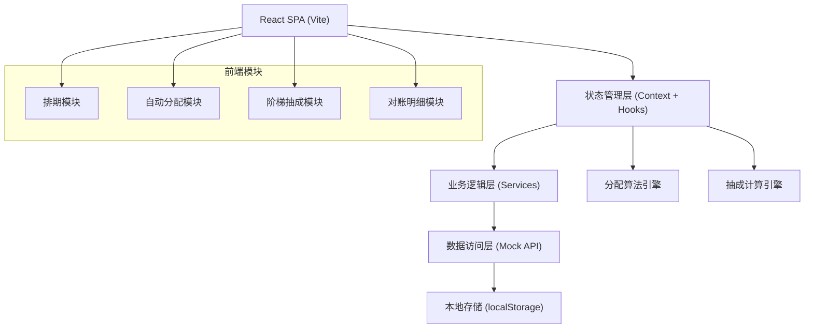
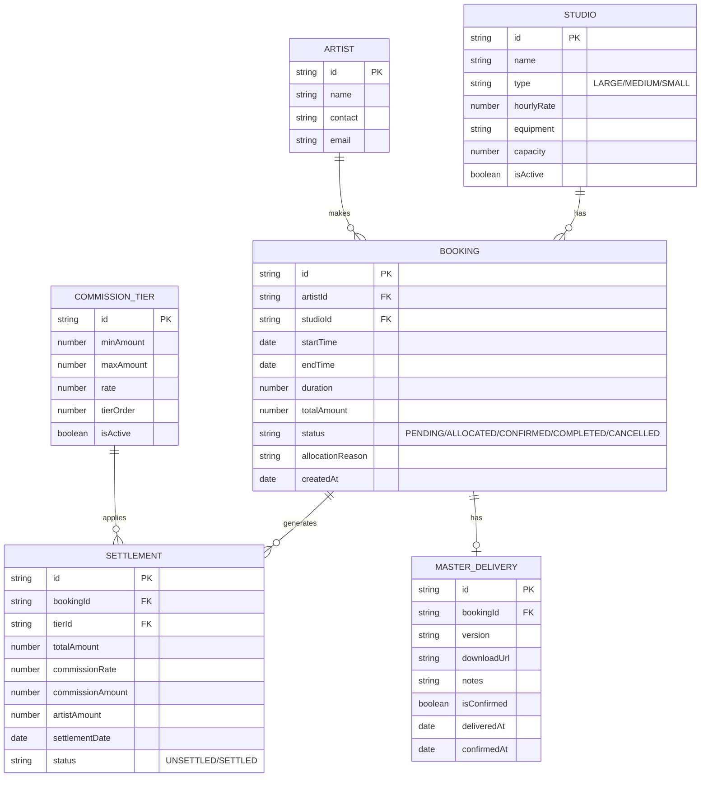

## 1. 架构设计



## 2. 技术描述

- **前端框架**: React@18 + TypeScript + Vite@5
- **样式方案**: TailwindCSS@3 + CSS Variables (主题系统)
- **路由管理**: React Router DOM@6
- **图表可视化**: Recharts@2 (数据仪表盘)
- **日期处理**: date-fns@3 (档期计算)
- **状态管理**: React Context + useReducer (轻量状态)
- **图标**: Lucide React@0.400
- **数据持久化**: localStorage (模拟后端存储)
- **后端**: 无后端，纯前端Mock数据实现

## 3. 路由定义

| 路由 | 页面 | 权限 | 说明 |
|------|------|------|------|
| /dashboard | 仪表盘 | 所有用户 | 数据概览、关键指标 |
| /studios | 录音棚管理 | 管理员 | 录音棚CRUD、排期日历 |
| /bookings | 预约管理 | 所有用户 | 预约列表、智能分配 |
| /commission | 抽成配置 | 管理员 | 阶梯档位设置 |
| /settlement | 对账明细 | 所有用户 | 分账明细、对账单 |
| /masters | 母带管理 | 所有用户 | 交付登记、版本管理 |

## 4. 数据模型



## 5. 核心算法实现

### 5.1 择优分配算法 (Allocation Engine)
```typescript
interface AllocationCandidate {
  studioId: string;
  studioName: string;
  score: number;
  reason: string;
}

function allocateStudio(
  booking: BookingRequest,
  studios: Studio[],
  existingBookings: Booking[]
): AllocationResult {
  // 1. 筛选空闲录音棚
  const availableStudios = filterAvailableStudios(booking, studios, existingBookings);
  
  // 2. 计算每个候选棚的评分
  const candidates = availableStudios.map(studio => ({
    studioId: studio.id,
    studioName: studio.name,
    score: calculateAllocationScore(studio, booking, existingBookings),
    reason: generateAllocationReason(studio, booking)
  }));
  
  // 3. 按评分排序返回最优解
  candidates.sort((a, b) => b.score - a.score);
  return {
    success: candidates.length > 0,
    bestMatch: candidates[0],
    alternatives: candidates.slice(1, 3)
  };
}

function calculateAllocationScore(
  studio: Studio,
  booking: BookingRequest,
  existingBookings: Booking[]
): number {
  let score = 0;
  
  // 碎片避免权重 (40%)：检查前后是否可合并为连续时段
  const fragmentationPenalty = calculateFragmentationPenalty(studio, booking, existingBookings);
  score += (100 - fragmentationPenalty) * 0.4;
  
  // 负载均衡权重 (30%)：优先分配给本月使用率最低的棚
  const usageRate = calculateMonthlyUsageRate(studio, existingBookings);
  score += (100 - usageRate) * 0.3;
  
  // 规格匹配权重 (30%)：根据人数/时长匹配棚规格
  const specMatchScore = calculateSpecMatchScore(studio, booking);
  score += specMatchScore * 0.3;
  
  return score;
}
```

### 5.2 阶梯抽成计算引擎 (Commission Engine)
```typescript
interface CommissionCalculation {
  currentTier: CommissionTier;
  cumulativeAmount: number;
  nextTierThreshold: number;
  progressToNextTier: number;
  commissionRate: number;
}

function calculateCommission(
  bookingAmount: number,
  monthlyBookings: Booking[],
  tiers: CommissionTier[]
): CommissionCalculation {
  // 1. 计算本月累计成交额（不含当前订单）
  const cumulativeAmount = monthlyBookings
    .filter(b => b.status === 'COMPLETED')
    .reduce((sum, b) => sum + b.totalAmount, 0);
  
  // 2. 计算包含当前订单后的总成交额
  const totalAfterThisBooking = cumulativeAmount + bookingAmount;
  
  // 3. 查找对应档位
  const currentTier = findTierForAmount(totalAfterThisBooking, tiers);
  
  // 4. 计算距下一档位进度
  const nextTier = findNextTier(currentTier, tiers);
  const progressToNextTier = nextTier 
    ? ((totalAfterThisBooking - currentTier.maxAmount) / (nextTier.minAmount - currentTier.maxAmount)) * 100
    : 100;
  
  return {
    currentTier,
    cumulativeAmount: totalAfterThisBooking,
    nextTierThreshold: nextTier?.minAmount || null,
    progressToNextTier: Math.min(progressToNextTier, 100),
    commissionRate: currentTier.rate
  };
}
```

## 6. 目录结构

```
src/
├── components/          # 通用组件
│   ├── layout/         # 布局组件 (Sidebar, Header)
│   ├── ui/             # 基础UI (Button, Card, Modal, Table)
│   └── charts/         # 图表组件
├── pages/              # 页面组件
│   ├── Dashboard/
│   ├── Studios/
│   ├── Bookings/
│   ├── Commission/
│   ├── Settlement/
│   └── Masters/
├── services/           # 业务逻辑层
│   ├── allocation.service.ts    # 分配算法
│   ├── commission.service.ts    # 抽成计算
│   ├── studio.service.ts
│   ├── booking.service.ts
│   └── settlement.service.ts
├── store/              # 状态管理
│   ├── AppContext.tsx
│   └── reducers/
├── types/              # TypeScript类型定义
│   └── index.ts
├── data/               # Mock数据
│   ├── mockStudios.ts
│   ├── mockBookings.ts
│   ├── mockArtists.ts
│   └── mockTiers.ts
├── utils/              # 工具函数
│   ├── dateUtils.ts
│   └── formatters.ts
├── App.tsx
├── main.tsx
└── index.css           # 全局样式 + Tailwind + 主题变量
```

## 7. 主题配置 (CSS Variables)

```css
:root {
  /* 主色系 - 黑金高端质感 */
  --color-bg-primary: #0a0a0a;
  --color-bg-secondary: #141414;
  --color-bg-tertiary: #1a1a1a;
  
  --color-gold: #d4af37;
  --color-gold-light: #e6c86a;
  --color-gold-dark: #b8960c;
  
  /* 功能色 */
  --color-success: #3ddc97;
  --color-warning: #ffd166;
  --color-error: #ff6b6b;
  --color-info: #9d4edd;
  
  /* 文本色 */
  --color-text-primary: #ffffff;
  --color-text-secondary: #a0a0a0;
  --color-text-muted: #666666;
  
  /* 边框与阴影 */
  --border-gold: 1px solid rgba(212, 175, 55, 0.3);
  --shadow-gold: 0 4px 20px rgba(212, 175, 55, 0.15);
  --shadow-glow: 0 0 20px rgba(212, 175, 55, 0.4);
  
  /* 字体 */
  --font-display: 'Playfair Display', serif;
  --font-body: 'Inter', -apple-system, sans-serif;
}
```
